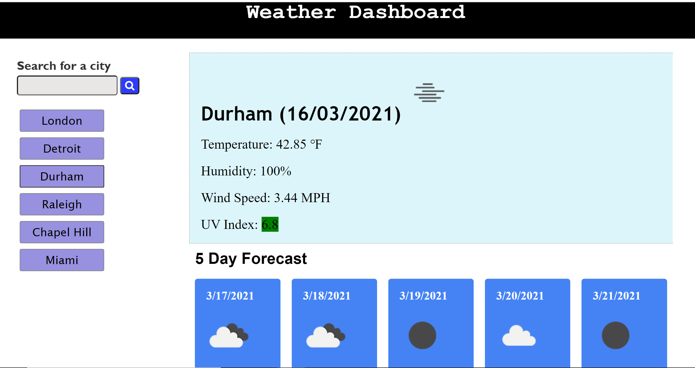

# Weather-Search-Page

This project is a weather dashboard application. The user can type a city into the search bar, and the weather info for that city will be displayed, including a 5 day forecast. When the user searched for a city, the city name will be added to local storeage, and displayed on the page as a button so that the user may quiickly pull up info for that city again. The application uses the openweather api along with custom css and javascript for functionality and styling. 

Link: https://bac5806.github.io/Weather-Search-Page/